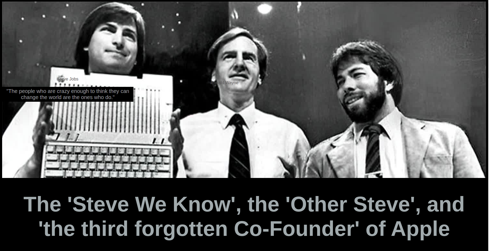
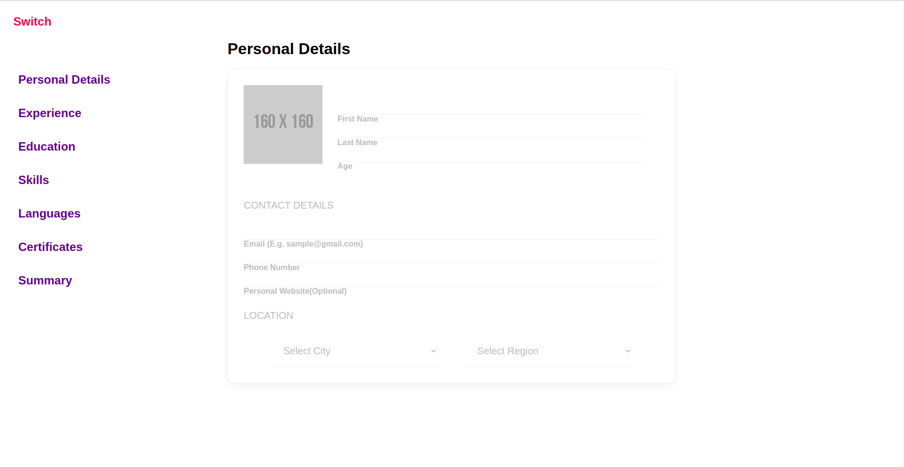
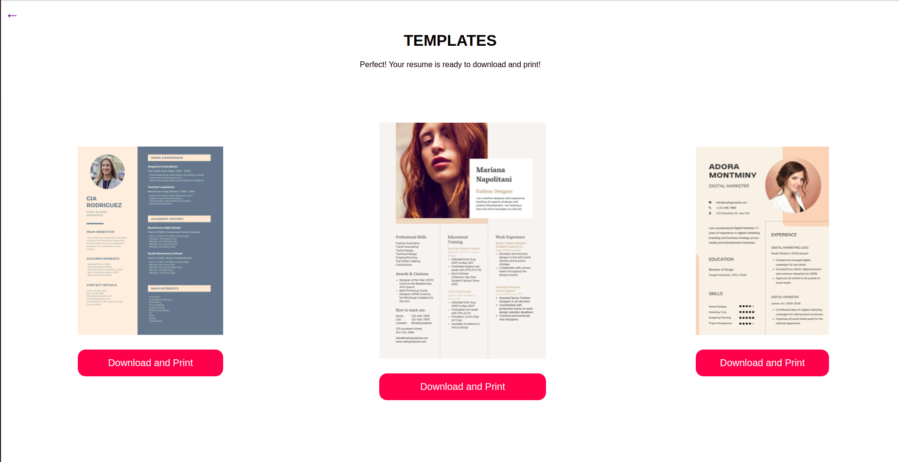
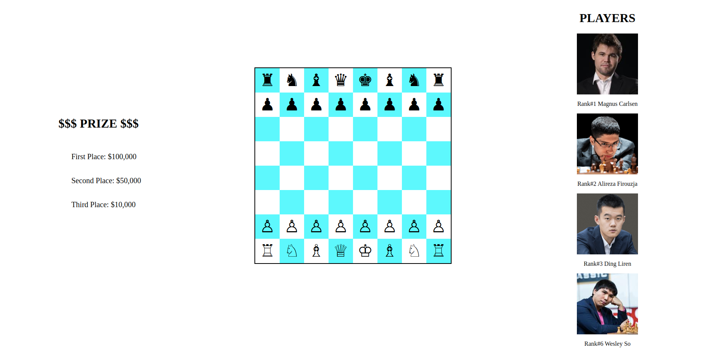
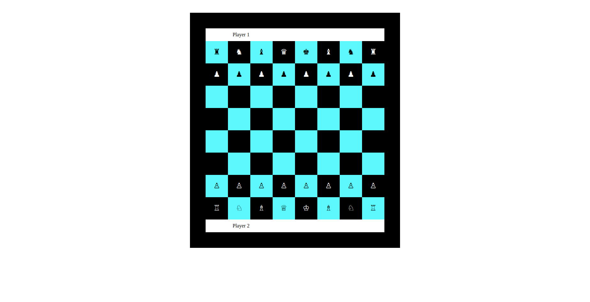

# batch18-fe-activities

## Projects
1. [**Tribute Page**](https://github.com/grailwilly/batch18-fe-activities/tree/main/tribute-page) 
    - Tools: Visual Code, HTML & CSS
    - Colors: grey and black
    - Font: Sans Serif
    - Plan: Can't choose which Steve I should pay tribute so I just put them in one frame and found out there was a third Co-founder.

2. [**Survey Form**](https://github.com/grailwilly/batch18-fe-activities/tree/main/survey-form)
    - Tools: Visual Code, HTML & CSS
    - Theme: Resume Builder
    - To do: improve field inputs sizes, labels on top, pick better color palettes, and validation error message.

3. **Chessboard** - [**Flex**](https://github.com/grailwilly/batch18-fe-activities/tree/main/chessboard-flex) and [**Grid CSS**](https://github.com/grailwilly/batch18-fe-activities/tree/main/chessboard-grid)
    - Tools: Visual Code, HTML & CSS
    - Web responsive using Flex and Grid CSS

  
    